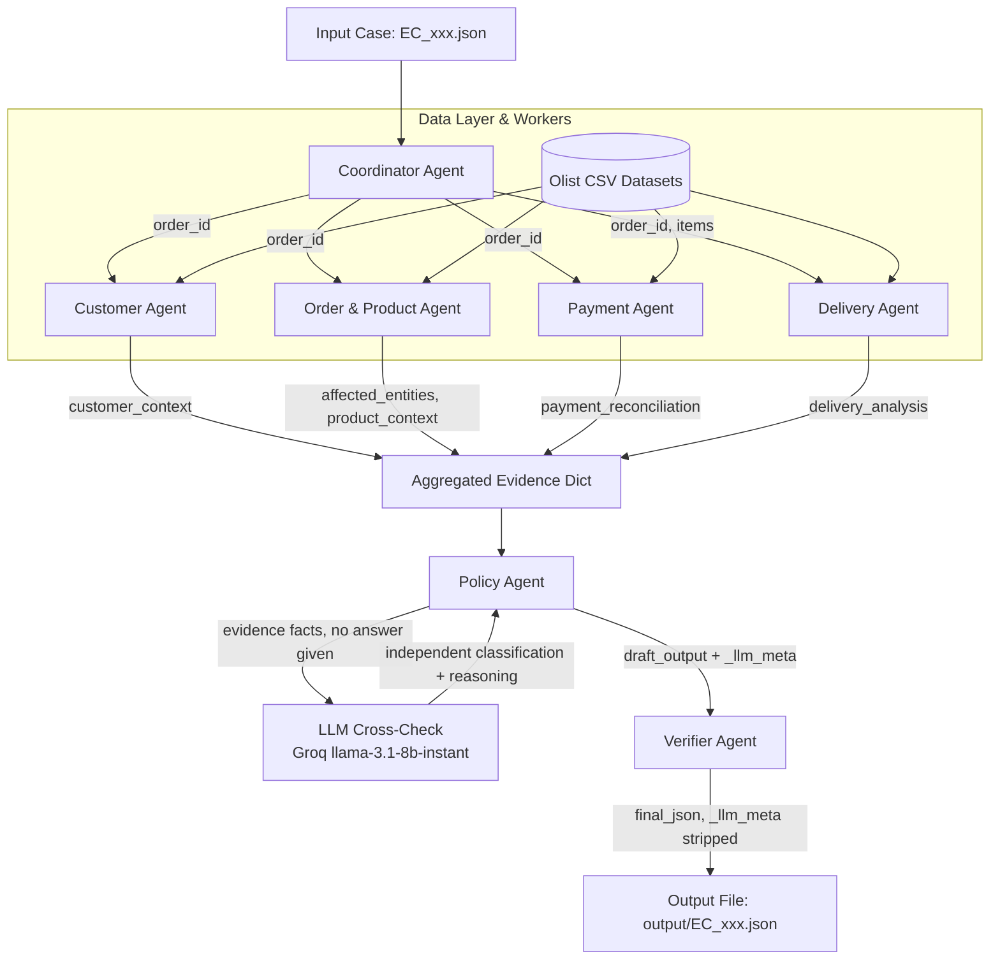

# Architecture Specification — Multi-Agent E-commerce Dispute Resolution

 Kiến trúc hệ thống tuân theo mô hình **Supervisor-Worker Agent Architecture** nhằm xử lý 50 case khiếu nại thương mại điện tử từ dữ liệu Olist.

## 1. Sơ đồ Kiến trúc Hệ thống (Agent Workflow)

---

## 2. Vai trò & Quyền truy cập từng Agent

| Agent Name | Vai trò | Dữ liệu truy cập (CSVs) | Trách nhiệm chính |
| :--- | :--- | :--- | :--- |
| **Coordinator Agent** | Supervisor / Orchestrator | Input JSONs | Khởi tạo pipeline, điều phối 4 worker agent, gộp kết quả thành `evidence` dict. |
| **Customer Agent** | Worker (Person 1) | `olist_customers_dataset.csv`, `olist_orders_dataset.csv` | Tra cứu `customer_unique_id`, các đơn hàng lịch sử (`related_order_ids`), xác định `repeat_customer`. |
| **Order & Product Agent** | Worker (Person 1) | `olist_orders_dataset.csv`, `olist_order_items_dataset.csv`, `olist_products_dataset.csv`, `product_category_name_translation.csv` | Thu thập `item_ids`, `seller_ids`, `product_ids`, `category_names`, phát hiện multi-item, multi-seller, multi-category. |
| **Payment Agent** | Worker (Person 1) | `olist_order_payments_dataset.csv` | Tính toán tổng thanh toán `payment_total_brl`, đối soát với tổng item + freight (`reconciled`), kiểm tra `split_payment`. |
| **Delivery Agent** | Worker (Person 1) | `olist_orders_dataset.csv`, `olist_order_items_dataset.csv` | Tính sai số giao hàng `delivery_variance_hours`, sai số bàn giao của seller `handoff_variance_hours`, phát hiện seller bàn giao trễ. |
| **Policy Agent** | Rule Engine + LLM Cross-Check (Person 2) | Evidence Dict | `rule_engine()` áp dụng bảng quy tắc `EC_POLICY_V2` một cách xác định (deterministic) để tính `primary_issue`, `secondary_issues`, `root_cause_analysis`, `financial_resolution`, `resolution_actions`, `evidence_ids`. Sau đó `llm_classify()` gọi model `llama-3.1-8b-instant` (Groq, ≤10B) để **độc lập** phân loại lại case chỉ từ evidence đã tính (không được biết đáp án của rule engine), dùng làm cơ sở tính `confidence` và làm bước kiểm chứng chéo thật sự giữa 2 agent. |
| **Verifier Agent** | Quality Control (Person 2) | Draft Output Dict + `_llm_meta` | Phân tích JSON schema, kiểm tra giới hạn mảng (Array bounds), xử lý giá trị null, làm tròn số tiền, kiểm định Evidence IDs, và loại bỏ field nội bộ `_llm_meta` trước khi xuất file (không thuộc schema output). |

### Cơ chế kiểm chứng LLM (Policy Agent handoff)

- `rule_engine(evidence)` là nguồn sự thật đáng tin cậy (deterministic), đã verify khớp với ví dụ mẫu trong README (case `EC_002`: `late_delivery_seller`, refund 18.27 BRL).
- `llm_classify(evidence, rule_result)` gửi cho model một checklist 6 rule với `condition_met` đã tính sẵn (boolean), **không** gửi kèm đáp án của rule engine, và yêu cầu model tự chọn `primary_issue` + `confidence` + lý do ngắn.
- Nếu LLM đồng ý với rule engine: `confidence` bắt đầu từ 0.97, trừ điểm nếu dữ liệu ở biên (giao hàng trong vòng 6h so với ước tính, sai số thanh toán gần ngưỡng 0.10 BRL, seller handoff sát hạn, hoặc đơn không có item) — phản ánh đúng mức độ chắc chắn dựa trên dữ liệu thật, không phải một số cố định.
- Nếu LLM không đồng ý: hệ thống **luôn giữ kết quả của rule engine** (đã verify đúng), hạ `confidence` xuống 0.75 để phản ánh sự bất đồng, và ghi lại vào `trace.jsonl` (`llm_agrees_with_rule_engine`, `llm_primary_issue`, `llm_reasoning`) — đây chính là bước "handoff và kiểm chứng giữa các agent" mà README yêu cầu, không chỉ là nhiều agent cùng chạy một prompt.
- Gọi API có retry/backoff cho lỗi `429 Too Many Requests` (Groq free tier rate limit), đảm bảo pipeline chạy ổn định hết 50 case.

---

## 3. Luồng Handoff Dữ liệu (Handoff Flow)

1. **Step 1 (Input Handling)**: Coordinator tiếp nhận `case_id` và `claimed_order_id` từ `input/EC_*.json`.
2. **Step 2 (Parallel Evidence Gathering)**: Coordinator kích hoạt 4 Worker Agents truy xuất dữ liệu Olist.
3. **Step 3 (Evidence Aggregation)**: Kết quả từ 4 Worker được gộp thành 1 đối tượng `evidence` duy nhất.
4. **Step 4 (Policy Evaluation)**: Policy Agent thực thi đánh giá dựa trên `EC_POLICY_V2` để sinh ra `draft_output`.
5. **Step 5 (Verification & Output)**: Verifier Agent kiểm tra các ràng buộc kỹ thuật (schema, null, rounding, array bounds) và ghi ra file `output/EC_*.json`.
